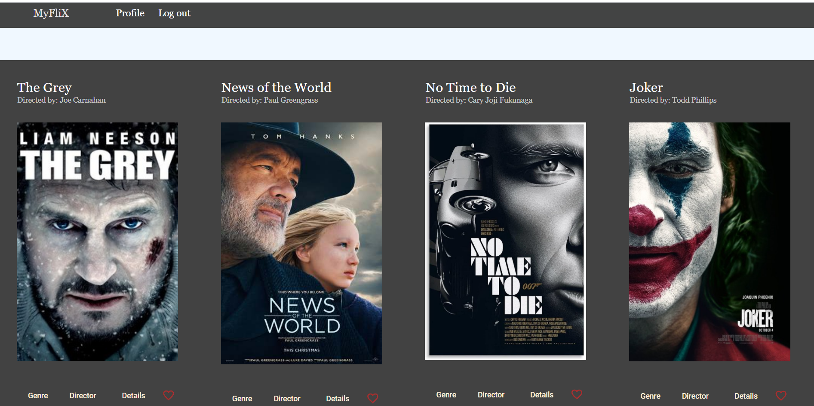

# MyFlixAngularClient

## Overview
MyFLix application is responsive movie app built with Angular, with routing and several interface views. The client-side will support the existing
server-side by facilitating user requests and rendering the response from [Movie Api Repository](https://github.com/Begli0102/movie_api) server-side via a number of different interface views. In this app the user will be able to see movies, see their details, genre informations,director informations, add them to the favorite,delete them and update profile informaton

[Click here to see the demo ](https://begli0102.github.io/myFlix-Angular-client/welcome)

- This project was generated with [Angular CLI](https://github.com/angular/angular-cli) version 12.1.4.

## Development server

Run `ng serve` for a dev server. Navigate to `http://localhost:4200/`. The app will automatically reload if you change any of the source files.

## Code scaffolding

Run `ng generate component component-name` to generate a new component. You can also use `ng generate directive|pipe|service|class|guard|interface|enum|module`.

## Build

Run `ng build` to build the project. The build artifacts will be stored in the `dist/` directory.

## Running unit tests

Run `ng test` to execute the unit tests via [Karma](https://karma-runner.github.io).

## Running end-to-end tests

Run `ng e2e` to execute the end-to-end tests via a platform of your choice. To use this command, you need to first add a package that implements end-to-end testing capabilities.

## Further help

To get more help on the Angular CLI use `ng help` or go check out the [Angular CLI Overview and Command Reference](https://angular.io/cli) page.
